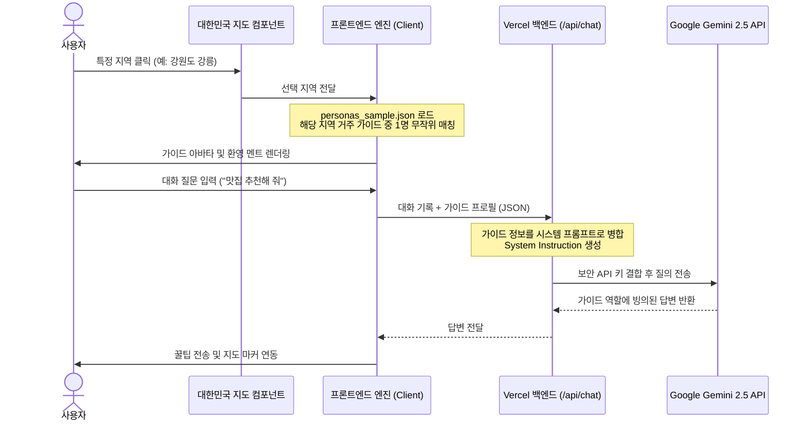

# 로컬 스토리 챗봇 페르소나 설계 및 데이터 연동 사양서 (Chatbot Persona Specification)

본 문서는 투어리즘 인사이트(Tourism Insight)의 핵심 서비스인 **'로컬 스토리 AI 가이드 챗봇'**에 탑재된 가상 현지인 캐릭터(Persona) 시스템의 기획 배경, 데이터 추출 및 정제 프로세스, 시스템 연동 메커니즘을 상세히 정의합니다.

---

## 1. 페르소나 시스템 개요

* **기획 배경**: 기존의 범용 여행 챗봇은 기계적이고 서구 중심적인 정보 탐색에 머물러 있었습니다. 이를 탈복하기 위해 대한민국 특정 지역에 실제로 거주하고 생활하는 가상의 현지인 캐릭터(Persona)를 연동하여, 사용자에게 극적인 몰입감과 실감 나는 로컬 여행 꿀팁을 제공합니다.
* **소버린 AI(Sovereign AI)의 실사례**: 서구 편향적인 문맥에서 벗어나 대한민국의 실제 인구통계학적 특성, 지역 문화, 지역 특색이 묻어나는 자연스러운 정서(존댓말, 현지 라이프스타일)를 반영하도록 설계되었습니다.

---

## 2. 원본 데이터셋 및 정제 프로세스 (Data Processing)

우리 챗봇 가이드 매칭에 사용되는 데이터는 **NVIDIA의 'Nemotron-Personas-Korea' 합성 데이터셋**을 뼈대로 삼고 있습니다.

### 2.1 원본 데이터셋의 강점
* **통계적 사실성**: 대한민국 통계청(KOSIS), 대법원, 국민건강보험공단 등의 실제 인구 분포 통계를 기초로 합성되어 연령대별 직업군, 가구 형태, 거주 주택 종류 등이 실제 사회 구조 비율과 정확히 맞아떨어집니다.
* **개인정보 보호**: 실제 사람의 데이터가 아니라 통계적 법칙에 의해 100% 합성된 데이터(Synthetic Data)이므로, 개인정보 보호법(PIPA)을 저촉하지 않고 고품질의 페르소나 프로필을 안심하고 사용할 수 있습니다.

### 2.2 파이썬 기반 데이터 추출 및 정제 규칙 (`process_personas.py`)
웹 애플리케이션의 경량성과 고속 로딩 성능을 확보하기 위해, 700만 개의 데이터셋에서 핵심 표본만 필터링하여 압축하는 배치 프로세스를 거쳤습니다.

1. **시도별 균등 샘플링**: 대한민국의 17개 시도(특별시, 광역시, 도 등)별 지역 다양성을 고르게 수용할 수 있도록 지역별 그룹을 구분했습니다.
2. **시도당 최대 30개 추출**: 각 시도별로 무작위 샘플링(Random Sampling)을 실행하되, 시도당 최대 **30개**까지만 추출하여 저장소 공간 낭비를 방지했습니다.
3. **최종 산출물**: 중복 데이터를 제거한 최종 **500여 개 내외의 정예 페르소나군**을 생성하여 `src/data/personas_sample.json` 정적 파일로 패키징했습니다.

---

## 3. 챗봇 페르소나 연동 메커니즘 (Integration Flow)

사용자가 챗봇을 작동할 때 페르소나가 매칭되어 AI 두뇌로 주입되는 동적 설계 흐름입니다.

### 3.1 시스템 프롬프트(System Instruction) 동적 결합
챗봇 질의 시, 매칭된 가상의 인물이 본인의 캐릭터에 완전히 동화되어 말하도록 Vercel 서버리스 엔진단에서 시스템 프롬프트를 실시간으로 조립하여 AI(Gemini)에 함께 전달합니다.

* **전달되는 가이드 프로필 상세 예시**:
  * **거주지**: 강원도 강릉시
  * **나이/성별**: 70대 여성 (차을순)
  * **직업**: 무직 (평생 가족 건사를 위해 헌신한 베테랑 주부)
  * **문화적 배경**: 강릉 중앙시장의 옛 정취 속에서 갯배를 타고 자란 추억 보유
  * **취미/관심사**: 대관령 숲길 친구들과 걷기, 임영웅 노래 감상, 동네 미용실 파마
* **결과**: 인공지능이 "임영웅 노래를 즐겨 들으며 강릉 중앙시장의 추억을 간직한 동네 할머니"의 나긋나긋한 어조로 가이드 경로를 제안하게 됩니다.

### 3.2 다국어 자동 치환 (`persona_translations.json`)
외국인 사용자가 언어를 영어, 중국어, 일본어로 바꿀 경우를 대비해, 가이드의 나이/성별/직업명/취미 명칭을 사전에 약속된 번역 데이터와 결합하여 외국인의 화면에도 깨지지 않고 번역된 프로필 카드가 노출되도록 대응 체계를 마련했습니다.

---

## 4. UI/UX 확장 기능

1. **경로 파싱 및 구글 지도 연동**:
   * AI 가이드가 추천한 명칭(예: `[오죽헌]`, `[안목해변]`)을 프론트엔드가 수신 즉시 실시간 좌표로 매핑하여 구글 맵 API(`TravelRouteMap`)에 동선으로 시각화합니다.
2. **수채화 엽서 형태 가이드북 다운로드 (`html2canvas`)**:
   * 설계된 코스 요약과 로컬 푸드 정보, 매칭된 가이드 아바타 및 소개글을 조합하여 감성적인 엽서 디자인 템플릿을 생성합니다.
   * 사용자는 **[가이드북 다운로드]** 버튼을 통해 해당 엽서 영역을 고화질 이미지로 스마트폰이나 PC에 즉시 보관할 수 있습니다.
