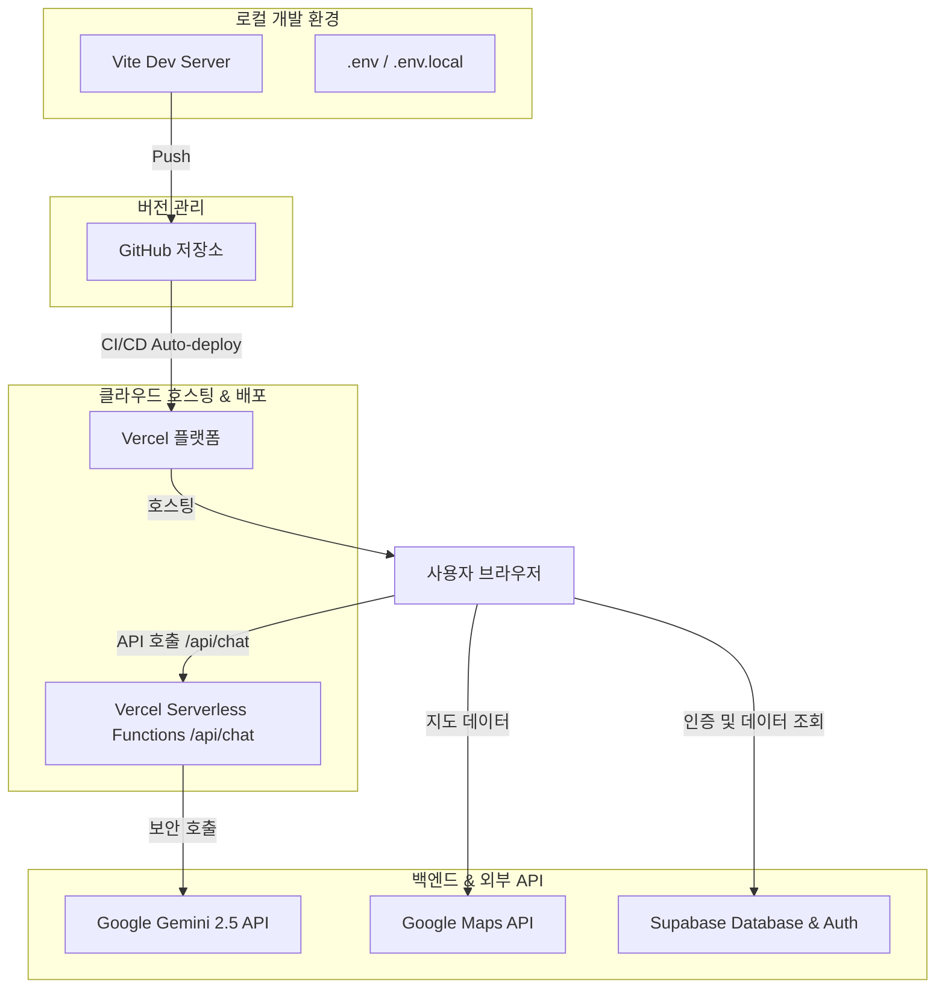

# 투어리즘 인사이트 홈페이지 리뉴얼 개발 환경 사양서 (Development Environment Specification)

본 문서는 투어리즘 인사이트(Tourism Insight) 홈페이지 리뉴얼 프로젝트의 전체 기술 스택, 프레임워크, 배포 플랫폼, 데이터 수집 파이프라인 및 개발 환경에 대해 정의합니다.

---

## 1. 아키텍처 개요 (Architecture Overview)

본 프로젝트는 고성능 프론트엔드 기술과 서버 관리 비용을 최소화한 **서버리스(Serverless) 아키텍처**를 채택하였습니다. 소스 코드는 **GitHub**를 기반으로 버전 관리가 이루어지며, **Vercel**을 통해 개발 서버 및 실시간 서비스 배포가 완전 자동화되어 있습니다.

---

## 2. 세부 기술 스택 (Technical Stack)

### 2.1 프론트엔드 (Frontend Client)
사용자 인터페이스(UI) 및 브라우저 단에서 동작하는 클라이언트 영역입니다.

| 분류 | 기술명 | 버전 | 용도 및 설명 |
| :--- | :--- | :--- | :--- |
| **코어 프레임워크** | React | `^18.3.1` | 컴포넌트 기반 선언형 웹 UI 프레임워크 |
| **빌드 & 런타임** | Vite | `^5.4.19` | 초고속 HMR(Hot Module Replacement) 지원 빌드 도구 |
| **언어** | TypeScript | `^5.8.3` | 엄격한 정적 타입을 제공하여 소스 코드 품질 및 컴파일 안정성 보장 |
| **스타일링** | TailwindCSS | `^3.4.17` | 유틸리티 퍼스트 디자인 프레임워크 (신속한 UI 개발 및 마크업) |
| **UI 라이브러리** | Shadcn/ui (Radix UI) | - | 웹 표준 접근성을 준수하는 반응형 모던 컴포넌트 셋 제공 |
| **애니메이션** | Framer Motion | `^11.1.9` | 챗봇 대화창 및 화면 전환 시 부드러운 애니메이션 효과 부여 |
| **상태 관리** | React Query (TanStack) | `^5.83.0` | 서버 데이터 상태 관리 및 캐싱 최적화 |
| **라우팅** | React Router DOM | `^6.30.1` | 화면 내 클라이언트 사이드 라우팅 및 다중 페이지 주소 지정 |
| **지도 연동** | @react-google-maps/api | `^2.20.3` | 여행 가이드 맵 내 마커 렌더링 및 길찾기 시각화 구현 |

### 2.2 백엔드 & 인프라 (Backend & Cloud Infrastructure)
서버 유지 관리 리소스를 생략하고 API 수준의 유연한 확장을 위한 백엔드 설정입니다.

* **배포 & 호스팅 플랫폼**: **Vercel**
  * Git 푸시 시 프로덕션 빌드 및 배포가 자동화된 **CI/CD 파이프라인**을 제공합니다.
  * 백엔드 API 서버 없이 독립적인 기능을 수행하는 **서버리스 함수(Serverless Functions)** 기능을 지원합니다.
* **데이터베이스 및 인증 (BaaS)**: **Supabase**
  * PostgreSQL 엔진 기반의 유연한 관계형 데이터베이스 환경을 제공합니다.
  * 소셜 및 이메일 기반 회원가입/로그인을 담당하는 **Supabase Auth** 모듈을 내장하고 있습니다.
* **AI 연동 API**: **Google Gemini 2.5 API**
  * AI 가이드 챗봇 기능의 핵심 모델입니다.
  * **보안 환경설정**: 클라이언트단(브라우저)에서 API Key 노출을 막기 위해 Vercel 서버리스 백엔드 주소(`/api/chat`)를 통해 호출하도록 구조가 최적화되어 있습니다.

---

## 3. 데이터 파이프라인 & 크롤러 스크립트 (Data Pipeline)

관광 트렌드 데이터 분석 및 뉴스 피드 자동 갱신을 위해 별도의 독립적인 파이프라인 시스템을 가동 중입니다.

* **네이버 뉴스 및 정보 크롤러 (Python)**:
  * `scrape_naver_search.py`, `scrape_naver_sections.py` 등 네이버 최신 뉴스와 트렌드를 수집하는 다수의 배치용 크롤러가 탑재되어 있습니다.
* **DB 동기화 스크립트 (Node.js CommonJS)**:
  * 수집한 뉴스 원본 데이터를 가공하고 최신화하여 Supabase PostgreSQL에 자동으로 밀어넣는 배치 스크립트가 내장되어 있습니다 (`update_db_summaries.cjs`, `update_news.cjs`).
* **독립형 뉴스룸 에이전트 연동 (`AutoAgent`)**:
  * 구글 트렌드 분석과 소셜 키워드 마이닝을 거쳐 최종 선별된 고품질 인사이트를 Supabase 배포 포트에 자동 퍼블리싱하는 배치 에이전트 프로세스가 병행 운용 중입니다.

---

## 4. 환경 변수 및 보안 관리 (Security & Variables)

프로젝트에 연동된 핵심 보안 크레덴셜은 외부 유출을 원천 방지하도록 설계되었습니다.

1. **로컬 환경 관리**: `.env` 및 `.env.local` 파일을 통해 로컬에서 개발 서버 구동 시 필요한 비밀키를 수동으로 입력하여 사용합니다. (Git 커밋 금지 항목 설정)
2. **운영 환경 관리**: Vercel 대시보드의 **Environment Variables** 설정을 통해 클라우드 빌드 및 런타임에 직접 주입됩니다.
3. **보안 규칙**:
   * 브라우저에서 볼 수 있는 클라이언트 환경 변수는 접두사 `VITE_`를 붙여 구분합니다 (예: `VITE_SUPABASE_URL`, `VITE_GOOGLE_MAPS_API_KEY`).
   * 서버(백엔드) 내부에서만 실행되는 비밀 키는 접두사를 완전히 제외하여 브라우저 유출을 원천 격리합니다 (예: `GEMINI_API_KEY`, `GOOGLE_CREDENTIALS`).
